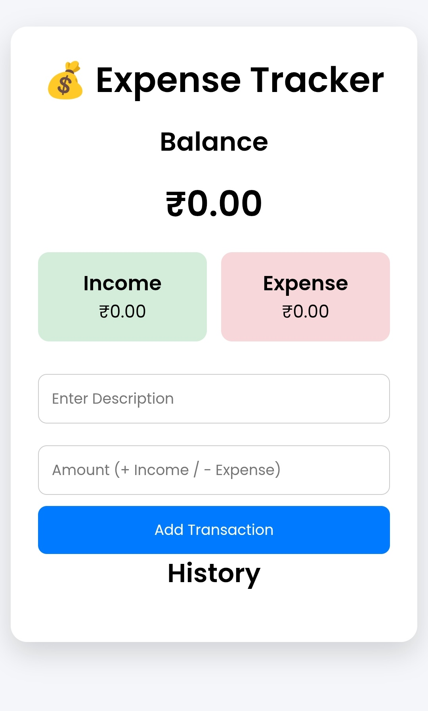

# 💰 Expense Tracker

A modern Expense Tracker built using HTML, CSS, and JavaScript. It allows users to add, manage, and track daily expenses with an easy-to-use and responsive interface.

---

## ✨ Features

- ➕ Add new expenses
- 🗑️ Delete expenses
- 💵 Automatic total calculation
- 📅 Track daily spending
- 📱 Responsive design
- ⚡ Fast and simple interface

---

## 🛠️ Technologies Used

- HTML5
- CSS3
- JavaScript

---

## 📸 Screenshot



---

## 🌐 Live Demo

https://sushantsonawanex1-ui.github.io/expense-tracker/

---

## 📂 Repository

https://github.com/sushantsonawanex1-ui/expense-tracker

---

## 📁 Project Structure

```text
expense-tracker/
│── index.html
│── style.css
│── script.js
│── Screenshot_20260705_202240.jpg
└── README.md
```

---

## 🎯 What I Learned

While building this project, I learned:

- JavaScript arrays and objects
- DOM manipulation
- Event handling
- Dynamic data updates
- Responsive UI design
- GitHub Pages deployment

---

## 👨‍💻 Author

**Sushant Sonawane**

GitHub:
https://github.com/sushantsonawanex1-ui
